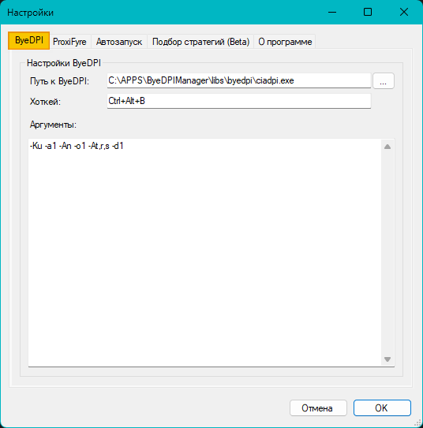

## <a name="set-byedpi">Описание настроек вкладки ByeDPI</a>



* Блок **"Настройки ByeDPI"**
  * ```Путь к ByeDPI``` - здесь указывается путь до исполняемого файла *ciadpi.exe*
  * ```Хоткей``` - указание сочетания клавиш для включения/отключения ByeDPI Manager.
  * ```Аргументы``` - в данном поле указываются аргументы запуска *ciadpi.exe*. Комбинацию агрументов в сообществе по ByeDPI Manager и ByeByeDPI называют *стратегией*. В данное поле надо вводить только <ins>**одну**</ins> стратегию без лишних символов.

   
