## <a name="set-proxifyre">Описание настроек вкладки ProxiFyre</a>

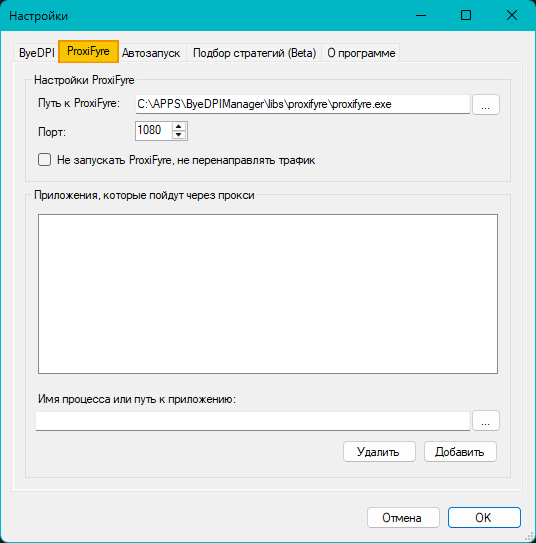

* Блок **"Настройки ProxiFyre"**
  * ```Путь к ProxiFyre``` - здесь указывается путь до исполняемого файла *proxifyre.exe*
  * ```Порт``` - указание для ProxiFyre порта, на котором запущен прокси-сервер, в данном случае ByeDPI.
   По умолчанию: 1080.
   
   >[!NOTE]
   >Если по какой-либо причине порт уже занят другим приложением и ByeDPI Manager в логе выдает ошибку
    ```ByeDPI: bind: 10013```
    то для смены порта надо изменить его не только в поле "Порт" настройках ProxiFyre, но и также добавить аргумент 
    ```-p<порт>```
    в поле "Аргументы" на вкладке ByeDPI окна настроек.
    
* Блок **"Приложения, которые пойдут через прокси"**
  * В данном блоке расположен список имен программ, которые будут обрабатываться ProxiFyre и направлены в ByeDPI. Ниже описаны вариант добавления.
</br>
   >[!IMPORTANT]
   >**Если не добавлено ни одного процесса, то ВСЕ приложения будут обработаны ProxiFyre и направлены в ByeDPI**

## <a name="set-pf-adprog">Варианты добавления в список ProxiFyre</a>

Процессы программ в список ProxiFyre можно добавлять несколькими способами:

1. **Указание полного пути к исполняемому файлу**  
   
   * Достаточно нажать кнопку ```...``` и выбрать нужный файл в появившемся окне.
   * Выбранный файл будет добавлен в список приложений.
   </br>
   <details><summary>Картиночки</summary>

   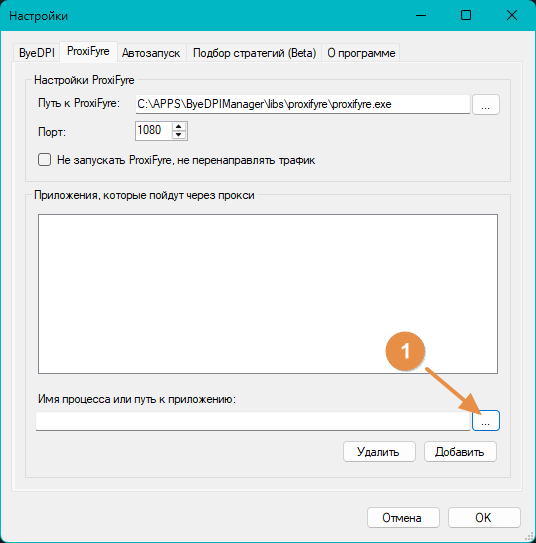

   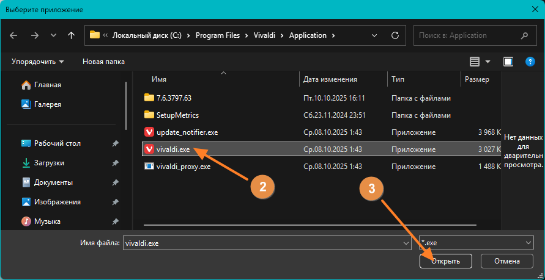

   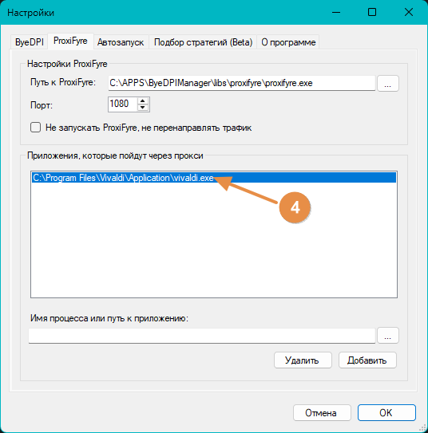
   </details></br>

2. **Указание только имени или части имени исполняемого файла**
   
   Если указать только имя или часть имени испольняемого файла, то все исполняемые файлы, содержащие данное указание, будут обрабатываться ProxiFyre
   >Пример: Firefox или firefox.exe будут соответствовать браузеру Firefox.
    Любое приложение, содержащее эту подстроку, также будет соответствовать, например, NewFirefox.exe.

   * Для указания надо вручную ввести часть имени в поле ```Имя процесса или путь к приложениию``` и нажать кнопку ```Добавить```
   </br>
   <details><summary>Картиночки</summary>
   
   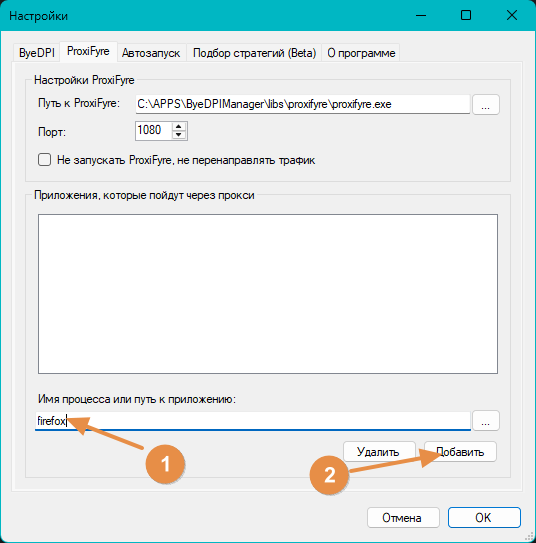

   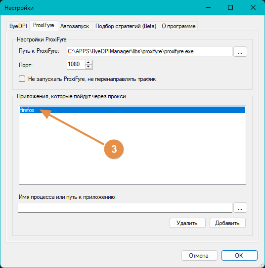

   </details></br>

3. **Указание полного или частичного пути к директории**
   
   При указании пути к директории все исполняемые файлы, находящиеся в данной директории, будут обрабатываться ProxiFyre.
   Также путь может быть не полным
    >Это позволяет ориентироваться на целую папку (полезно для приложений UWP).
    Пример №1: C:\Users\\**{user}**\AppData\Local\Discord\
      (Вместо **{user}** - имя директории пользователя)
    Пример №2: C:\Program FIles\WindowsApps\ROBLOXCORPORATION.ROBLOX
      (Доступ к директории ```WindowsApps``` требует запуска от администратора.)
   * Для указания надо ввести полный или частичный путь директории в поле ```Имя процесса или путь к приложениию``` и нажать кнопку ```Добавить```
    
   </br>
    <details><summary>Картиночки</summary>
   
   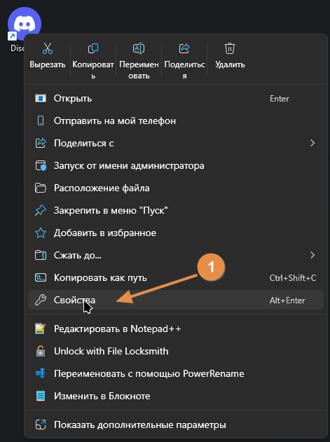

   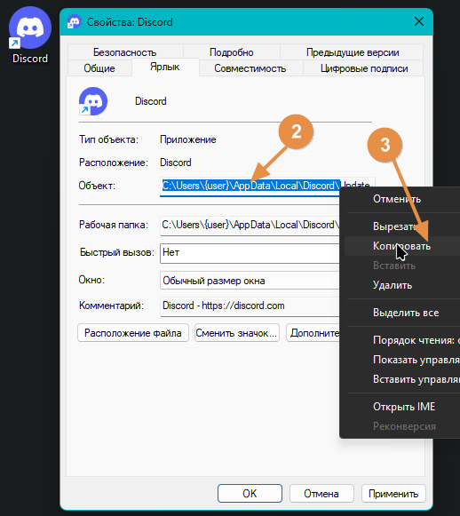

   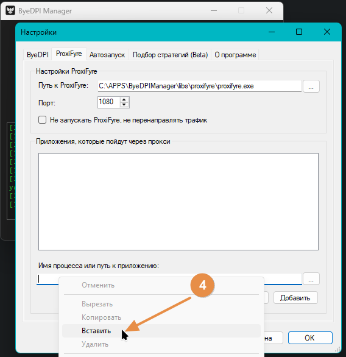

   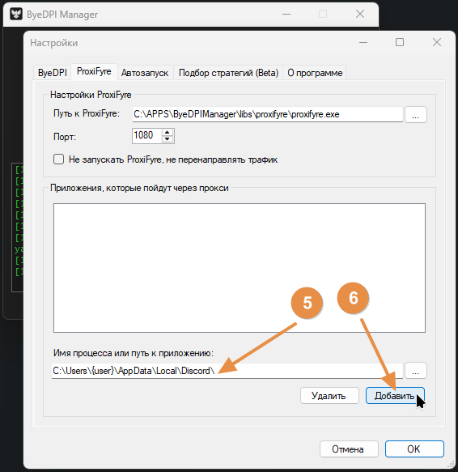

   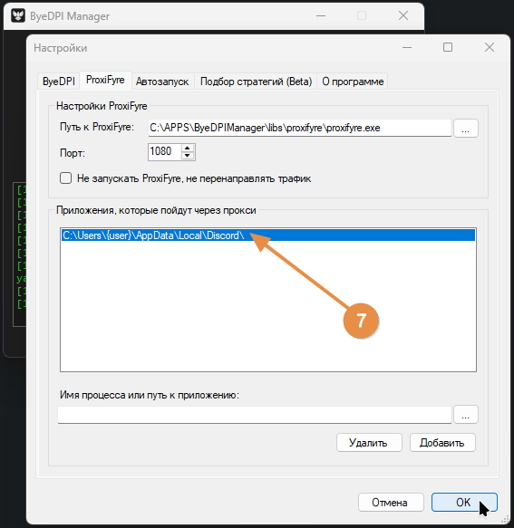
   
   </details>


## <a name="set-pf-noproxyfire">Работа без ProxiFyre (а-ля "Режим прокси")</a>

При установки галки ```Не запускать ProxiFyre, не перенаправлять трафик``` соответственно при запуске ByeDPI Manager (кнопка "Подключить" на главном окне) сервис ProxiFyre запускаться не будет. Будет запущен только прокси-сервер ByeDPI. 
При использовании данного режима, чтобы ByeDPI начал обрабатывать трафик нужных программ, необходимо уже в самих программах настроить использование прокси или использовать другой прокификатор, выполняющий туже роль, что и ProxiFyre.

<!-- в разработке 
* Пример использования Google Chrome без расширения
* Пример использования Google Chrome с помощью расширения Proxy SwitchyOmega 3 (ZeroOmega)
* Пример использования Firefox без расширения
* Пример использования Firefox с помощью расширения ZeroOmega--Proxy SwitchyOmega V3
-->