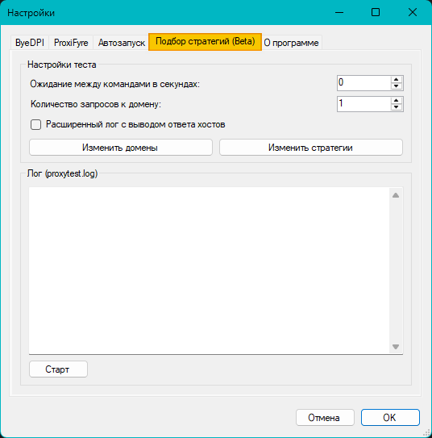

## <a name="set-strattest">Описание настроек вкладки Подбор статегий (Beta)</a>



* Блок **"Настройка теста"**
  * ```Ожидание между командами в секундах``` - пауза между каждым запросом к доменам. 
  * ```Количество запросов к домену``` - количество попыток использования статегии к каждому домену. Рекоменгдуется указывать значение около 5.
  * ```Расширенный лог с выводом ответа хостов``` - показать подробный результат по каждому домену при тестировании стратегий
  * Кнопка ```Изменить домены``` - при нажатии открывается файл *domains.txt* со списком доменов для тестирования.
  * Кнопка ```Изменить стратегии``` - при нажатии открывается файл *strategies.txt* со списком стратегий для тестирования.
* Блок **"Лог (proxytest.log)"**
  * Поле вывода лога - поле, в котором показывается результат тестирования стратегий и откуда можно копировать стратегии для вставки в поле ```Аргументы``` на вкладке **ByeDPI**. 
  * Кнопка ```Старт``` - собственно, кнопка запуска тестирования стратегий.
   